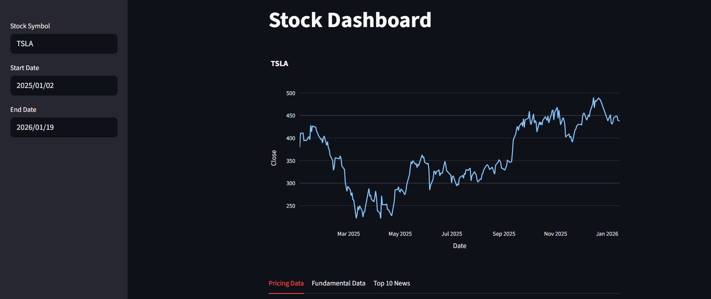
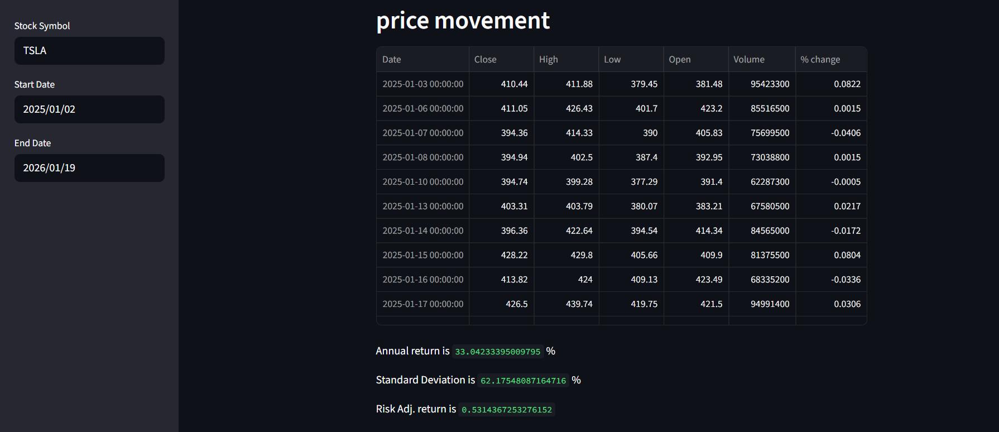
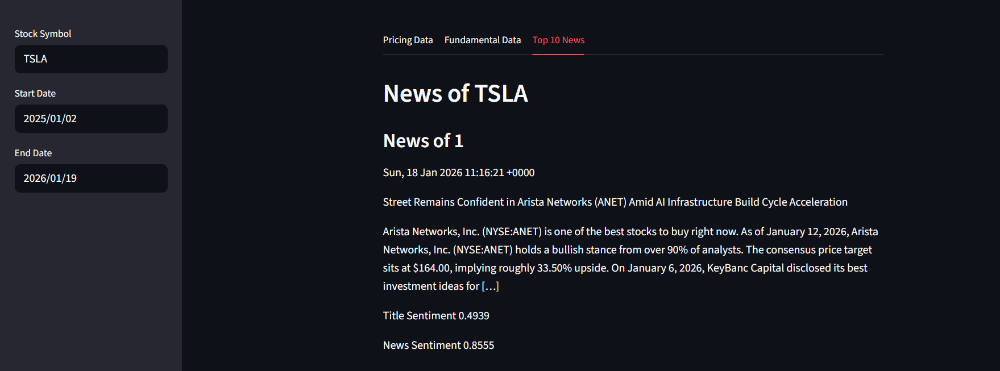

## 📈 Stock Dashboard App + News



Dashboard saham sederhana untuk memantau dan menganalisis pergerakan harga saham US dengan fitur untuk melihat News terbaru.

### Fitur
---
- Grafik **Visualisasi** pergerakan harga Saham.
- Perhitungan **Annual Return** dan **Standard Deviation**.
- Menampilkan **Balance Sheet, Laporan Laba Rugi, dan Arus Kas**.
- Fitur untuk melihat **10 berita terbaru** terkait saham tersebut beserta analisis sentimen.

### Tools
---
- **Framework**: Streamlit
- **Library Data**: `yfinance`, `alpha_vantage`, `stocknews`
- **Data Processing**: Pandas, Numpy
- **Visualisasi**: Plotly Express

### How to run
---
1.  **Clone repository**

    ```bash
    git clone https://github.com/Yudi-Gnwn/stock-dashboard.git
    cd stock-dashboard
    ```

2.  **Install library**

    ```bash
    pip install -r requirements.txt
    ```

3.  **Setup API Key**

    - Dapatkan API Key pada Website [Alpha Vantage](https://www.alphavantage.co/).
    - Masukkan API Key ke dalam variabel `key` di file `stock_dashboard.py`.

4.  **Run app**
    ```bash
    streamlit run app.py
    ```

### 📸 Preview
---
##### Fundamental Data


##### Stock News


---
---

**Note:** *Aplikasi ini dibuat untuk keperluan portofolio. Segala keputusan investasi yang diambil adalah tanggung jawab individu.*